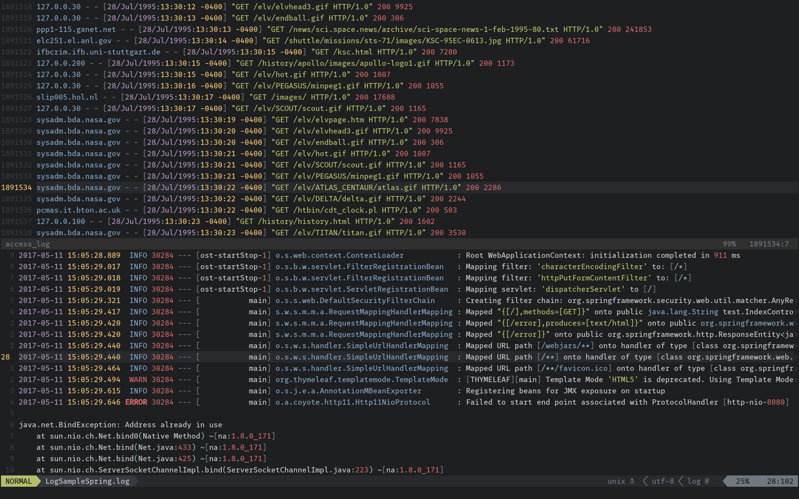

# Vim Log Highlighting



## Overview

Provides syntax highlighting for generic log files in VIM.

Some of the highlighted elements are:
- Dates and times
- Common log level keywords like ERROR, INFO, DEBUG
- Numbers, booleans and strings
- URLs and file paths
- IP and MAC addresses
- SysLog format columns
- XML Tags


## Installation

### [VimPlug](https://github.com/junegunn/vim-plug)

Add `Plug 'mtdl9/vim-log-highlighting'` to your `~/.vimrc` and run `PlugInstall`.

### [Vundle](https://github.com/gmarik/Vundle.vim)

Add `Plugin 'mtdl9/vim-log-highlighting'` to your `~/.vimrc` and run `PluginInstall`.

### [Pathogen](https://github.com/tpope/vim-pathogen)

    $ git clone https://github.com/mtdl9/vim-log-highlighting ~/.vim/bundle/vim-log-highlighting

### Manual Install

Copy the contents of the `ftdetect` and `syntax` folders in their respective ~/.vim/\* counterparts.


## Configuration

Once installed, the syntax highlighting will be enabled by default for files ending with `.log` and `_log` suffixes.

By default only uppercase keywords are recognized as level indicators in the log files.
You can add additional log level keywords using the standard VIM syntax functions, for example by adding this to your `.vimrc` file:

```viml
" Add custom level identifiers
au rc Syntax log syn keyword logLevelError MY_CUSTOM_ERROR_KEYWORD
```

Likewise you can disable highlighting for elements you don't need:

```viml
" Remove highlighting for URLs
au rc Syntax log syn clear logUrl
```


## Related Projects

* VIM Built-in /var/log/messages highlighting
* [vim-log-syntax](https://github.com/dzeban/vim-log-syntax) by dzeban
* [vim-log4j](https://github.com/tetsuo13/Vim-log4j) by tetsuo13
* [ccze](https://github.com/cornet/ccze) by cornet
